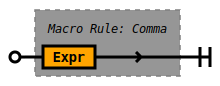
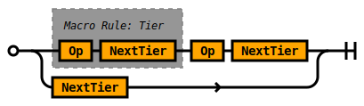
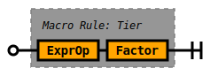
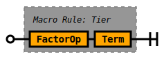
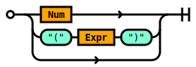

# Full Grammar

## Rule Exprs

A comma delimited set of expressions




```ebnf
rule Exprs ::=
    Comma!(Expr) 
  ;

```


## Rule Comma

A comma delimited set of rules.

No trailing comma permitted.

There may be zero or many rules.


```ebnf
macro Comma<T> ::=
    ( T  ',' ) *  T ?  
  ;

```


## Rule Tier



```ebnf
macro Tier<Op, NextTier> ::=
    Tier!(Op, NextTier) Op NextTier 
  | NextTier 
  ;

```


## Rule Expr



```ebnf
rule Expr ::=
    Tier!(ExprOp, Factor) 
  ;

```


## Rule Factor



```ebnf
rule Factor ::=
    Tier!(FactorOp, Term) 
  ;

```


## Rule ExprOp


```ebnf
rule ExprOp ::=
     '+' 
  |  '-' 
  ;

```


## Rule FactorOp


```ebnf
rule FactorOp ::=
     '*' 
  |  '/' 
  ;

```


## Rule Term



```ebnf
rule Term ::=
    Num 
  |  '(' Expr  ')' 
  | 
  ;

```


## Rule Num

One or many decimal digits.


```ebnf
rule Num ::=
     'r#[0-9]+#' 
  ;

```


##

Well, that was fun wasn't it.


